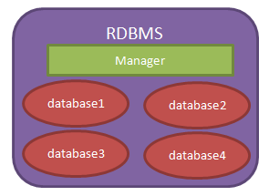
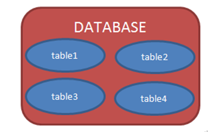
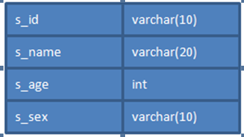
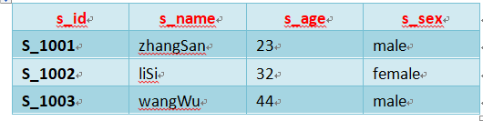
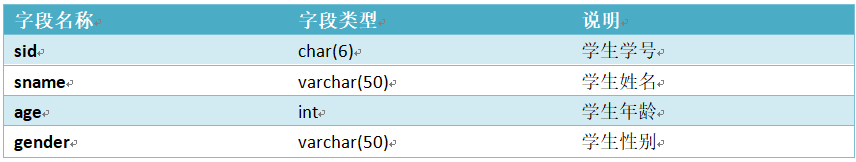
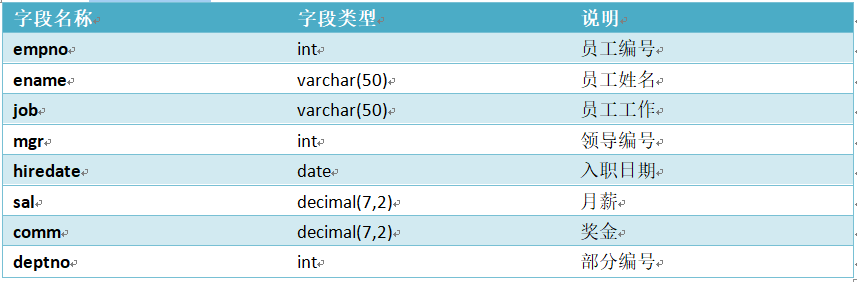
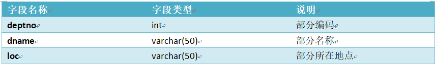
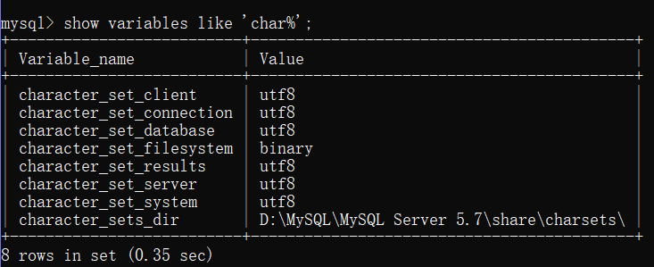

# MYSQL学习笔记

## 一、MYSQL概念

### 1.什么是数据库

​	数据库就是用来**存储和管理**数据的仓库！

​	数据库存储数据的优势：

- 可存储大量数据；
- 方便检索；
- 保持数据的一致性、完整性；
- 安全，可共享；
- 通过组合分析，可产生新数据。

#### 1.1数据库发展历程

- ​	没有数据库，使用磁盘文件存储数据；
- 层次结构模型数据库；
- 网状结构模型数据库；
- 关系结构模型数据库：使用二维表格来存储数据；关系型数据库都是以表的形式存储数据；
- 关系-对象模型数据库；

MySQL、Oracle就都关系型数据库~

#### 1.2常见的数据库

- Oracle：甲骨文；
- DB2：IBM；
- SQL Server：微软；
- Sybase：赛尔斯；
- MySQL：甲骨文；

#### 1.3数据库系统的组成部分

- 数据库：用于存储数据的地方。
- 数据库管理系统（RDBMS）：用于管理数据库的软件。
- 数据库应用程序：为了提高数据库系统的处理能力所使用的管理数据库的软件补充。

#### 1.4管理数据库

​	RDBMS = 管理员（manager）+仓库（database）

​	database = N个table

​	table：

​		表结构：定义表的列名和列类型！

​		表记录：一行一行的记录！

​	我们现在所说的数据库泛指“关系型数据库管理系统（RDBMS - Relational database management system）”，即“数据库服务器”。



​	当我们安装了数据库服务器后，就可以在数据库服务器中创建数据库，每个数据库中还可以包含多张表。



​		数据库表就是一个多行多列的表格。在创建表时，需要指定表的列数，以及列名称，列类型等信息。而不用指定表格的行数，行数是没有上限的。下面是tab_student表的结构：



​		当把表格创建好了之后，就可以向表格中添加数据了。向表格添加数据是以行为单位的！下面是s_student表的记录：




#### 1.5应用程序与数据库

​		应用程序使用数据库完成对数据的存储~


### 2.SQL语言

#### 2.1SQL概述

1.1　什么是SQL

​		SQL（Structured Query Language）是“结构化查询语言”，它是对关系型数据库的操作语言。它可以应用到所有关系型数据库中，例如：MySQL、Oracle、SQL Server等。

​        SQ标准（ANSI/ISO）有：

- SQL-92：1992年发布的SQL语言标准；
- SQL:1999：1999年发布的SQL语言标签；
- SQL:2003：2003年发布的SQL语言标签；

​		这些标准就与JDK的版本一样，在新的版本中总要有一些语法的变化。不同时期的数据库对不同标准做了实现。

​		虽然SQL可以用在所有关系型数据库中，但很多数据库还都有标准之后的一些语法，我们可以称之为“方言”。例如MySQL中的LIMIT语句就是MySQL独有的方言，其它数据库都不支持！当然，Oracle或SQL Server都有自己的方言。

#### 2.2SQL语法要求

​		SQL语句可以单行或多行书写，以分号结尾；

​		可以用空格和缩进来来增强语句的可读性；

​		关键字不区别大小写，建议使用大写。

#### 2.3**数据类型**

​		MySQL与Java一样，也有数据类型。MySQL中数据类型主要应用在列上。

常用类型：

​		int：整型 ；

​		double：浮点型，例如double(5,2)表示最多5位，其中必须有2位小数，即最大值为999.99；

​		decimal：泛型型，在表达**钱**方面使用该类型，因为不会出现精度缺失问题；

​		char：固定长度字符串类型；  

​		varchar：可变长度字符串类型；

​		text：字符串类型；

​		blob：字节类型；

​		date：日期类型，格式为：yyyy-MM-dd；

​		time：时间类型，格式为：hh:mm:ss

​		timestamp：时间戳类型（时区）；

​		datetime：日期时间。

#### 2.4分类

- 数据定义语言 DDL（Data Definition Language）：用来定义数据库对象：库、表、列等，DROP\CREATE\ALTER;
- 数据操作语言 DML（Data Manipulation Language）：用来定义数据库记录,INSERT\UPDATE\DELETE;
- 数据查询语言 DQL（Data Query Language）：用来查询记录（数据）,SELECT;
- 数据控制语言 DCL（Data Control Language）：用来定义访问权限和安全级别,GRANT\REVOKE\COMMIT\ROLLBACK。

##### 2.4.1DDL

1、**基本操作**

​		查看所有数据库名称：SHOW DATABASES；　

​		切换数据库：USE mydb1，切换到mydb1数据库；

2、**操作数据库**

​		创建数据库：CREATE DATABASE [IF NOT EXISTS] mydb1；

​		创建数据库，例如：CREATE DATABASE mydb1，创建一个名为		mydb1的数据库。如果这个数据已经存在，那么会报错。例如：CREATE DATABASE IF NOT EXISTS mydb1，在名为mydb1的数据库不存在时创建该库，这样可以避免报错。

​		删除数据库：DROP DATABASE [IF EXISTS] mydb1；

​		删除数据库，例如：DROP DATABASE mydb1，删除名为mydb1的数据库。如果这个数据库不存在，那么会报错。DROP DATABASE IF EXISTS mydb1，就算mydb1不存在，也不会的报错。

​		修改数据库编码：ALTER DATABASE mydb1 CHARACTER SET utf8。

​		修改数据库mydb1的编码为utf8。注意，在MySQL中所有的UTF-8编码都不能使用中间的“-”，即UTF-8要书写为UTF8。

​		创建表：

​				CREATE TABLE 表名(

​						 列名 列类型,

​						列名 列类型,

​						 ......

​				);

~~~sql
create database mysqltest;
use mysqltest;
create table stu(
	sid char(6),
	sname varchar(20),
	age int,
	gender varchar(10)
);
select * from stu;
create table emp(
	eid char(6),
	ename varchar(50),
	age int,
	gender varchar(6),
	birthday DATE,
	hiredate DATE,
	salary decimal(7,2),
	resume varchar(1000)
);
select * from emp;
~~~

​		查看当前数据库中所有表名称：SHOW TABLES；　

​		查看指定表的创建语句：SHOW CREATE TABLE emp，查看emp表的创建语句；

​		查看表结构：DESC emp，查看emp表结构；

​		删除表：DROP TABLE emp，删除emp表；

​		修改表：

1. 修改之添加列：给stu表添加classname列：

 ~~~sql
ALTER TABLE stu ADD (classname varchar(100));
 ~~~

2. 修改之修改列类型：修改stu表的gender列类型为CHAR(2)：
 ~~~sql
ALTER TABLE stu MODIFY gender CHAR(2);   
 ~~~

3. 修改之修改列名：修改stu表的gender列名为sex：
~~~sql
ALTER TABLE stu change gender sex CHAR(2);   
~~~

4. 修改之删除列：删除stu表的classname列：
 ~~~sql
ALTER TABLE stu DROP classname;   	
 ~~~

5. 修改之修改表名称：修改stu表名称为student：
 ~~~sql
ALTER TABLE stu RENAME TO student;   
 ~~~

   ​	

##### 2.4.2DML

1、　插入数据

语法：

INSERT INTO 表名(列名1,列名2, …) VALUES(值1, 值2)

~~~sql
insert into stu(sid,sname,age,gender) values('s_1001','张三',23,'male');
insert into stu(sid,sname) values('s_1002','lisi');
select * from stu;
~~~

语法：

INSERT INTO 表名 VALUES(值1,值2,…)

因为没有指定要插入的列，表示按创建表时列的顺序插入所有列的值：

~~~sql
insert into stu values('s_1002','lisi',32,'female');
~~~

注意：所有字符串数据必须使用单引用！


2、    修改数据

语法：

UPDATE 表名 SET 列名1=值1, … 列名n=值n [WHERE 条件]

~~~sql
update stu set sname='zhansansan',age=32,gender='female' where sid='s_1001';
UPDATE stu SET sname=’liSi’, age=’20’ WHERE age>50 AND gender=’male’;
UPDATE stu SET sname=’wangWu’, age=’30’ WHERE age>60 OR gender=’female’;
UPDATE stu SET gender=’female’ WHERE gender IS NULL
UPDATE stu SET age=age+1 WHERE sname=’zhaoLiu’;
~~~

3、　删除数据

语法：

DELETE FROM 表名 [WHERE 条件]

~~~sql
DELETE FROM stu WHERE sid=’s_1001’003B
DELETE FROM stu WHERE sname=’chenQi’ OR age > 30;
DELETE FROM stu; 
~~~

清空整个表

语法：

TRUNCATE TABLE 表名

~~~sql
TRUNCATE TABLE stu; 
~~~

​		虽然TRUNCATE和DELETE都可以删除表的所有记录，但有原理不同。DELETE的效率没有TRUNCATE高！

​		TRUNCATE其实属性DDL语句，因为它是先DROP TABLE，再CREATE TABLE。而且TRUNCATE删除的记录是无法回滚的，但DELETE删除的记录是可以回滚的（回滚是事务的知识！）。

##### 2.4.3DCL

1、　创建用户

语法：

CREATE USER 用户名@地址 IDENTIFIED BY '密码';

~~~sql
CREATE USER user1@localhost IDENTIFIED BY ‘123’; 
CREATE USER user2@’%’ IDENTIFIED BY ‘123’; 
~~~

2、　给用户授权

　　语法：

GRANT 权限1, … , 权限n ON 数据库.* TO 用户名

~~~sql
GRANT CREATE,ALTER,DROP,INSERT,UPDATE,DELETE,SELECT ON mydb1.* TO user1@localhost;
GRANT ALL ON mydb1.* TO user2@localhost;
~~~

3、　撤销授权

　　语法：

　　REVOKE权限1, … , 权限n ON 数据库.* FORM 用户名

~~~sql
REVOKE CREATE,ALTER,DROP ON mydb1.* FROM user1@localhost;
~~~

4、　查看用户权限

语法：

SHOW GRANTS FOR 用户名

~~~sql
SHOW GRANTS FOR user1@localhost;
~~~

5、　删除用户

语法：

DROP USER 用户名

~~~sql
DROP USER user1@localhost;
~~~

6、　修改用户密码

语法：

USE mysql;

UPDATE USER SET PASSWORD=PASSWORD(‘密码’) WHERE User=’用户名’ and Host=’IP’;

FLUSH PRIVILEGES;

~~~sql
UPDATE USER SET PASSWORD=PASSWORD('1234') WHERE User='user2' and Host=’localhost’;
FLUSH PRIVILEGES;
~~~

##### 2.4.4DQL

​		数据查询语法（DQL）

​		DQL就是数据查询语言，数据库执行DQL语句不会对数据进行改变，而是让数据库发送结果集给客户端。

​		查询语法的一般结构：

​				SELECT selection_list 					**/*要查询的列名称*/**

​				FROM table_list 							**/*要查询的表名称*/**

​				WHERE condition 						**/*行条件*/**

​				GROUP BY grouping_columns **/*对结果分组*/**

​				HAVING condition 						**/*分组后的行条件*/**

​				ORDER BY sorting_columns 	  **/*对结果排序*/**

​				LIMIT offset_start, row_count 	**/*结果限定*/**

创建名：

+ 学生表：stu



~~~sql
create table stu (
	sid char(6),
    sname varchar(50),
    age int,
    gender varchar(50)
);

insert into stu values('s_1001','张三',22,'男');
INSERT INTO stu VALUES('s_1002', 'chenEr', 15, 'female');
INSERT INTO stu VALUES('s_1003', 'zhangSan', 95, 'male');
INSERT INTO stu VALUES('s_1004', 'liSi', 65, 'female');
INSERT INTO stu VALUES('s_1005', 'wangWu', 55, 'male');
INSERT INTO stu VALUES('s_1006', 'zhaoLiu', 75, 'female');
INSERT INTO stu VALUES('s_1007', 'sunQi', 25, 'male');
INSERT INTO stu VALUES('s_1008', 'zhouBa', 45, 'female');
INSERT INTO stu VALUES('s_1009', 'wuJiu', 85, 'male');
INSERT INTO stu VALUES('s_1010', 'zhengShi', 5, 'female');
INSERT INTO stu VALUES('s_1011', 'xxx', NULL, NULL);
~~~

+ 雇员表：emp



~~~~sql
create table emp (
	empno int,
    ename varchar(50),
    job varchar(50),
    mgr int,
    hiredate date,
    sal decimal(7,2),
    comm decimal(7,2),
    deptno int
);

INSERT INTO emp values(7369,'SMITH','CLERK',7902,'1980-12-17',800,NULL,20);
INSERT INTO emp values(7499,'ALLEN','SALESMAN',7698,'1981-02-20',1600,300,30);
INSERT INTO emp values(7521,'WARD','SALESMAN',7698,'1981-02-22',1250,500,30);
INSERT INTO emp values(7566,'JONES','MANAGER',7839,'1981-04-02',2975,NULL,20);
INSERT INTO emp values(7654,'MARTIN','SALESMAN',7698,'1981-09-28',1250,1400,30);
INSERT INTO emp values(7698,'BLAKE','MANAGER',7839,'1981-05-01',2850,NULL,30);
INSERT INTO emp values(7782,'CLARK','MANAGER',7839,'1981-06-09',2450,NULL,10);
INSERT INTO emp values(7788,'SCOTT','ANALYST',7566,'1987-04-19',3000,NULL,20);
INSERT INTO emp values(7839,'KING','PRESIDENT',NULL,'1981-11-17',5000,NULL,10);
INSERT INTO emp values(7844,'TURNER','SALESMAN',7698,'1981-09-08',1500,0,30);
INSERT INTO emp values(7876,'ADAMS','CLERK',7788,'1987-05-23',1100,NULL,20);
INSERT INTO emp values(7900,'JAMES','CLERK',7698,'1981-12-03',950,NULL,30);
INSERT INTO emp values(7902,'FORD','ANALYST',7566,'1981-12-03',3000,NULL,20);
INSERT INTO emp values(7934,'MILLER','CLERK',7782,'1982-01-23',1300,NULL,10);
~~~~

+ 部门表



~~~sql
create table dept (
	deptno int,
    dname varchar(14),
    loc varchar(13)
);
INSERT INTO dept values(10, 'ACCOUNTING', 'NEW YORK');
INSERT INTO dept values(20, 'RESEARCH', 'DALLAS');
INSERT INTO dept values(30, 'SALES', 'CHICAGO');
INSERT INTO dept values(40, 'OPERATIONS', 'BOSTON');
~~~

###### 1、基础查询

1、查询所有

~~~sql
select * from stu;
~~~

2、查询指定的列

~~~sql
select sid,sname,age from stu;
~~~

###### 2、条件查询

条件查询介绍：

条件查询就是在查询时给出WHERE子句，在WHERE子句中可以使用如下运算符及关键字：

+ =、!=、<>、<、<=、>、>=；

+ BETWEEN…AND；

+ IN(set)；

+ IS NULL；

+ AND；

+ OR；

+ NOT；

查询性别为女，并且年龄50的记录

~~~sql
select * from stu where gender='female' and age<50;
~~~

查询学号为S_1001，或者姓名为liSi的记录

~~~sql
select * from stu where sid='s_1001' or sname='LiSi';
~~~

查询学号为S_1001，S_1002，S_1003的记录

~~~sql
select * from stu where sid in('s_1001','s_1002','s_1004');
~~~

查询学号不是S_1001，S_1002，S_1003的记录

~~~sql
select * from stu where sid not in('s_1001','s_1002','s_1003');
~~~

查询年龄为null的记录

~~~sql
select * from stu where age is null;
~~~

查询年龄在20到40之间的学生记录

~~~sql
select * from stu where age>=20 and age<=40;
select * from stu where age between 20 and 40;
~~~

查询性别非男的学生记录

~~~~sql
select * from stu where gender!='male';
select * from stu where gender<>'male';
select * from stu where not gender='male';
~~~~

查询姓名不为null的学生记录
~~~~sql
select * from stu where not sname is null;
select * from stu where sname is not null;
~~~~

###### 3、模糊查询

​		当想查询姓名中包含a字母的学生时就需要使用模糊查询了。模糊查询需要使用关键字LIKE。

1、查询姓名由5个字母构成的学生记录

~~~sql
select * from stu where sname like '_____';
~~~

模糊查询必须使用LIKE关键字。其中 “_”匹配任意一个字母，5个“_”表示5个任意字母。

2、查询姓名由5个字母构成，并且第5个字母为“i”的学生记录

~~~sql
select * from stu where sname like '____i';
~~~

3、查询姓名以“z”开头的学生记录

~~~sql
select * from stu where sname like 'z%';
~~~

其中“%”匹配0~n个任何字母。

4、查询姓名中第2个字母为“i”的学生记录
~~~sql
select * from stu where sname like '_i%';
~~~


5、查询姓名中包含“a”字母的学生记录
~~~sql
select * from stu where sname like '%a%';
~~~

###### 4、字段控制查询

1、去除重复记录

​		去除重复记录（两行或两行以上记录中系列的上的数据都相同），例如emp表中sal字段就存在相同的记录。当只查询emp表的sal字段时，那么会出现重复记录，那么想去除重复记录，需要使用DISTINCT：

~~~sql
select distinct sal from emp;
~~~

2、查看雇员的月薪与佣金之和

　　因为sal和comm两列的类型都是数值类型，所以可以做加运算。如果sal或comm中有一个字段不是数值类型，那么会出错。

~~~sql
select *,sal+comm from emp;
~~~

​		comm列有很多记录的值为NULL，因为任何东西与NULL相加结果还是NULL，所以结算结果可能会出现NULL。下面使用了把NULL转换成数值0的函数IFNULL：

~~~sql
select *,sal+ifnull(comm,0) from emp;
~~~

3、给列名添加别名

​		在上面查询中出现列名为sal+IFNULL(comm,0)，这很不美观，现在我们给这一列给出一个别名，为total：

~~~sql
select *,sal+ifnull(comm,0) as total from emp;
~~~

给列起别名时，是可以省略AS关键字的：
~~~sql
select *,sal+ifnull(comm,0) total from emp;
~~~

###### 5、排序

1、查询所有学生记录，按年龄升序排序

~~~sql
select * from stu order by age asc;
select * from stu order by age;
~~~

2、查询所有学生记录，按年龄降序排序

~~~sql
select * from stu order by age desc;
~~~

3、查询所有雇员，按月薪降序排序，如果月薪相同时，按编号升序排序
~~~sql
select * from emp order by sal desc,empno asc;
~~~

###### 6、聚合函数

聚合函数是用来做纵向运算的函数：

+ COUNT()：统计指定列不为NULL的记录行数；

+ MAX()：计算指定列的最大值，如果指定列是字符串类型，那么使用字符串排序运算；

+ MIN()：计算指定列的最小值，如果指定列是字符串类型，那么使用字符串排序运算；

+ SUM()：计算指定列的数值和，如果指定列类型不是数值类型，那么计算结果为0；

+ AVG()：计算指定列的平均值，如果指定列类型不是数值类型，那么计算结果为0；

1、COUNT()

当需要纵向统计时可以使用COUNT()。

+ 查询emp表中记录数：

~~~sql
select count(*) as cnt from emp;
~~~

+ 查询emp表中有佣金的人数：

~~~sql
select count(comm) cnt from emp;
~~~

注意，因为count()函数中给出的是comm列，那么只统计comm列非NULL的行数。

+ 查询emp表中月薪大于2500的人数：

~~~sql
select count(*) from emp where sal>2500;
~~~

+ 统计月薪与佣金之和大于2500元的人数：

~~~sql
select count(*) as cnt from emp where sal+ifnull(comm,0) > 2500;
~~~

+ 查询有佣金的人数，以及有领导的人数：

~~~sql
select count(comm),count(mgr) from emp;
~~~

2、SUM() 和 AVG()

当需要纵向求和时使用sum()函数。

+ 查询所有雇员月薪和：

~~~sql
select sum(sal) from emp;
~~~

+ 查询所有雇员月薪和，以及所有雇员佣金和：
~~~sql
select sum(sal),sum(comm) from emp;
~~~


+ 查询所有雇员月薪+佣金和：
~~~sql
select sum( sal+ifnull(comm,0) ) from emp;
~~~


+ 统计所有员工平均工资：
~~~sql
select sum(sal)/count(sal) from emp;
select avg(sal) from emp;
~~~

3、MAX() 和 MIN()

+ 查询最高工资和最低工资：

~~~sql
select max(sal),min(sal) from emp;
~~~


###### 7、分组查询

​		当需要分组查询时需要使用GROUP BY子句，例如查询每个部门的工资和，这说明要使用部分来分组。

1、分组查询

+ 查询每个部门的部门编号和每个部门的工资和：

~~~sql
select deptno,sum(sal) from emp group by deptno;
~~~

+ 查询每个部门的部门编号以及每个部门的人数：

~~~sql
select deptno,count(*) from emp group by deptno;
~~~

+ 查询每个部门的部门编号以及每个部门工资大于1500的人数：

~~~sql
select deptno,count(*) from emp where sal>1500 group by deptno;
~~~

2、HAVING子句

+ 查询工资总和大于9000的部门编号以及工资和：

~~~sql
select deptno,sum(sal) from emp group by deptno having sum(sal)>9000;
~~~

注意，WHERE是对分组前记录的条件，如果某行记录没有满足WHERE子句的条件，那么这行记录不会参加分组；而HAVING是对分组后数据的约束。


###### 8、LIMIT

LIMIT用来限定查询结果的起始行，以及总行数。

1、查询5行记录，起始行从0开始

~~~sql
select * from emp limit 0,5;
~~~

注意，起始行从0开始，即第一行开始！

2、查询10行记录，起始行从3开始

 ~~~sql
select * from emp limit 3,10;
 ~~~

3、分页查询

如果一页记录为10条，希望查看第3页记录应该怎么查呢？

+ 第一页记录起始行为0，一共查询10行；
+ 第二页记录起始行为10，一共查询10行；
+ 第三页记录起始行为20，一共查询10行；

------


## 二、数据表的完整性约束

​		完整性约束是为了表的数据的正确性！如果数据不正确，那么一开始就不能添加到表中。

### 1、主键

​		当某一列添加了主键约束后，那么这一列的数据就不能重复出现。这样每行记录中其主键列的值就是这一行的唯一标识。例如学生的学号可以用来做唯一标识，而学生的姓名是不能做唯一标识的，因为学习有可能同名。

​		主键列的值不能为NULL，也不能重复！

　　指定主键约束使用PRIMARY KEY关键字

+ 创建表：定义列时指定主键：


~~~sql
create table stu(
	sid char(6) primary key,
    sname varchar(20),
    age int,
    gender varchar(10)
);
~~~

+ 创建表：定义列之后独立指定主键：

~~~sql
create table stu(
	sid char(6),
    sname varchar(20),
    age int,
    gender varchar(10),
    primary key(sid)
);
~~~

+ 修改表时指定主键：
~~~sql
alter table stu add primary key(sid);
~~~


+ 删除主键（只是删除主键约束，而不会删除主键列）：
~~~sql
alter table stu drop primary key;
~~~


### 2、主键自增长

​		MySQL提供了主键自动增长的功能！这样用户就不用再为是否有主键是否重复而烦恼了。当主键设置为自动增长后，在没有给出主键值时，主键的值会自动生成，而且是最大主键值+1，也就不会出现重复主键的可能了。

+ 创建表时设置主键自增长（主键必须是整型才可以自增长）：

~~~sql
create table stu(
	sid int primary key auto_increment,
    sname varchar(20),
    age int,
    gender varchar(10)
);
~~~

+ 修改表时设置主键自增长：

~~~sql
alter table stu change sid sid int auto_increment;
~~~

+ 修改表时删除主键自增长：
~~~sql
alter table stu change sid sid int;
~~~


### 3、非空

​		指定非空约束的列不能没有值，也就是说在插入记录时，对添加了非空约束的列一定要给值；在修改记录时，不能把非空列的值设置为NULL。

+ 指定非空约束：

~~~sql
create table stu(
	sid int primary key auto_increment,
    sname varchar(10) not null,
    age int,
    gender varchar(10)
);
~~~

​		当为sname字段指定为非空后，在向stu表中插入记录时，必须给sname字段指定值，否则会报错：

~~~sql
insert into stu(sid) values(1);
insert into stu(sid,sname) values(1,'张三');
~~~

　　插入的记录中sname没有指定值，所以会报错！


### 4、唯一

还可以为字段指定唯一约束！当为字段指定唯一约束后，那么字段的值必须是唯一的。这一点与主键相似！例如给stu表的sname字段指定唯一约束：

~~~sql
create table tab_ab (
	sid int primary key auto_increment,
    sname varchar(10) unique
);
insert into sname(sid,sname) values(1001,'zs');
insert into sname(sid,sname) values(1002,'zs');
~~~

　　当两次插入相同的名字时，MySQL会报错！


### 5、外键

​		主外键是构成表与表关联的唯一途径！

​		外键是另一张表的主键！例如员工表与部门表之间就存在关联关系，其中员工表中的部门编号字段就是外键，是相对部门表的外键。

​		外键就是用来约束这一列的值必须是另一张表的主键值。

+ 创建t_user表，指定uid为主键列：

~~~sql
create table t_user (
	uid int primary key auto_increment,
    uname varchar(20) unique not null
);
~~~

+ 创建t_section表，指定sid为主键列，u_id为相对t_user表的uid列的外键：

~~~sql
create table t_section (
	sid int primary key auto_increment,
	sname varchar(30),
	u_id int,
    constraint fk_t_user foreign key(u_id) references t_user(uid)
);
~~~

+ 修改t_section表，指定u_id为相对t_user表的uid列的外键：

~~~sql
alter table t_section
add constraint fk_t_user
foreign key(u_id)
references t_user(uid);
~~~

+ 修改t_section表，删除u_id的外键约束：

~~~sql
alter table t_section
drop foreign key fk_t_user;
~~~


### 6、表与表之间的关系

+ 一对一：例如t_person表和t_card表，即人和身份证。这种情况需要找出主从关系，即谁是主表，谁是从表。人可以没有身份证，但身份证必须要有人才行，所以人是主表，而身份证是从表。设计从表可以有两种方案：

  ​		在t_card表中添加外键列（相对t_user表），并且给外键添加唯一约束；

  ​		给t_card表的主键添加外键约束（相对t_user表），即t_card表的主键也是外键。

+ 一对多（多对一）：最为常见的就是一对多！一对多和多对一，这是从哪个角度去看得出来的。t_user和t_section的关系，从t_user来看就是一对多，而从t_section的角度来看就是多对一！这种情况都是在多方创建外键！

+ 多对多：例如t_stu和t_teacher表，即一个学生可以有多个老师，而一个老师也可以有多个学生。这种情况通常需要创建中间表来处理多对多关系。例如再创建一张表t_stu_tea表，给出两个外键，一个相对t_stu表的外键，另一个相对t_teacher表的外键。

------


## 三、索引

​	用于快速找出在某个列中由一定特性的行。若不用索引，mysql将从第一行开始全表扫描，知道找到相应的行。

### 1、简介

​		索引是一个单独的、存储在磁盘上的数据库结构，它们包含着对数据库表里所有记录的引用指针。

​		例如：select * from table where num =10000；不加索引将遍历整个表，直到找到num=1000。若在num列上加索引，不需要扫描表，直接在索引里找10000。

​		索引是在存储引擎中实现的。所有存储引擎支持每个表至少16个索引，总索引长度至少为256字节。

​		MySQL索引由两种：BTREE\HASH。

​		InnDB引擎只支持BTREE索引。


### 2、索引的分类

#### 1、普通索引和唯一索引

​	普通索引是mysql基本索引，允许在索引列插入重复值和空值。

​	唯一索引，索引值唯一，允许有空值。如果是组合索引，则列值的组合必须唯一。

​	主键索引是一种特殊的唯一索引，不允许有空值。

#### 2、单列索引和组合索引

​	单列索引，一个索引只包含一列。

​	组合索引，表上多个字段组合的索引，只用查询条件中使用了这些字段的左边字段时，索引才会被使用。

#### 3、全文索引

​	全文索引，类型FULLTEXT，在定义索引的列上支持值的全文查找，允许在这些索引列中插入重复值和空值。可以在CHAR、VARCHAR、TEXT类型的列上创建。

​	mysql中只有MyISAM存储引擎支持。

#### 4、空间索引

​	空间索引，是对空间数据类型的字段建立的索引，mysql中的空间索引有4种：GEOMETRY、POINT、LINESTRING、POLYGON。

​	创建空间索引的列，必须将声明位NOT NULL ,空间索引只能是存储索引为MyISAM的表中创建。

### 3、索引设计原则

1. 索引不能过多，过多的索引占用磁盘空间，影响INSERT、DELETE、UPDATE语句的性能。
2. 对经常需要更新的表，不要添加过多的索引。
3. 数据量小的表最好不添加索引，由于数据较少，查询花费的时间可能比遍历索引的时间更短。
4. 在不同值很少的列上不要建立索引。例：性别字段，只用男、女两种值，这时不要建索引，否则会严重降低数据的更新速度。
5. 当某列的数据具有唯一性的特性时，指定唯一索引。使用唯一索引可以提高查询速度。
6. 在频繁进行排序或分组（进行group by或order by操作）的列上建立索引，如果带排序的列有多个，可以在这些列上建立组合索引。

### 4、创建索引

格式：

```sql
方式一：
ALTER TABLE t_user ADD [UNIQUE|FULLTEXT|SPATIAL] [INDEX|KEY] [index_name](col_name[length],...) [ASC|DESC];
方式二：
CREATE [UNIQUE|FULLTEXT|SPATIAL] INDEX index_name ON table_name(col_name[length],...) [ASC|DESC];

例：InnDB引擎可用的索引
普通索引
ALTER TABLE t_user ADD INDEX idx_username(username(30));
CREATE INDEX idx_username ON t_user (username);
唯一索引
ALTER TABLE t_user ADD UNIQUE INDEX idx_phone(mobile_phone(11));
CREATE UNIQUE INDEX idx_phone ON t_user (mobile_phone);
单列索引
ALTER TABLE t_user ADD INDEX idx_pwd(password);
CREATE INDEX idx_pwd ON t_user (password);
组合索引
ALTER TABLE t_user ADD INDEX idx_username_pwd(username,password);
CREATE INDEX idx_username_pwd ON t_user (username,password);
不支持全文索引（MyISAM引擎支持）
不支持空间索引（MyISAM引擎支持）
```

### 5、删除索引

格式：

```sql
方式一：
ALTER TABLE t_user DROP INDEX idx_username;
方式二：
DROP INDEX idx_username_pwd ON t_user;
```

------


## 四、事务

### 1、什么是事务

​		**数据库中的事务是指对数据库执行一批操作，这些操作最终要么全部执行成功，要么全部失败。**

```
示例银行转账：
	A->B账户转100元；
过程：
	A账户减100元，B账户加100元。
有事务支持的2种结果：
	1、操作成功：A账户减少100；B账户增加100；
    2、操作失败：A、B两个账户都没有发生变化。
没有事务的结果：
	如果没有事务的支持，可能出现错：A账户减少了100，此时系统挂了，导致B账户没有加上100，而A账户凭空少了100。
```

### 2、事务的特性

**原子性(Atomicity)**

​		事务的整个过程如原子操作一样，最终要么全部成功，或者全部失败，这个原子性是从最终结果来看的，从最终结果来看这个过程是不可分割的。
**一致性(Consistency)**

​		事务开始之前、执行中、执行完毕，这些时间点，多个人去观察事务操作的数据的时候，看到的数据都是一致的；
**隔离性(Isolation)**

​		一个事务的执行不能被其他事务干扰。每个事务的执行过程是相对独立的；
**持久性(Durability)**

​		一个事务一旦提交，他对数据库中数据的改变就应该是永久性的。当事务提交之后，数据会持久化到硬盘；

### 3、事务操作

​		MYSQL中事务操作（隐式事务、显式事务）。

#### 1、隐式事务

​		mysql中事务默认是隐式事务，执行insert、update、delete操作的时候，数据库自动开启事务、提交、回滚事务。

​		是否开启隐式事务是由变量`autocommit`控制的。

```sql
SHOW VARIABLES LIKE 'autocommit';
```

#### 2、显式事务

​		事务需要手动开启、提交或回滚，由开发者自己控制。

> 注意：navicat与DOS终端显式不一致，一下以DOS终端为主。

**方式一：**

```sql
-- 关闭隐式事务
set autocommit=0;

-- 提交事务
SHOW VARIABLES LIKE 'autocommit';
SET autocommit=0;
SHOW VARIABLES LIKE 'autocommit';
INSERT INTO emp values(1,'MK','JAVA',0,'1980-12-17',0,NULL,0);
SELECT * FROM emp WHERE empno = 1;
COMMIT;

-- 回滚事务
INSERT INTO emp values(2,'emm','sql',0,'1980-12-17',0,NULL,0);
SELECT * FROM emp WHERE empno = 2;
ROLLBACK;

-- 还原
SET autocommit=1;
SHOW VARIABLES LIKE 'autocommit';
```

**方式二：**

```sql
-- 开启显式事务（一次性使用，无需手动关闭~）
START TRANSACTION;
SHOW VARIABLES LIKE 'autocommit';

-- 提交事务
START TRANSACTION;
INSERT INTO emp values(3,'emm1','sql',0,NULL,0,NULL,0);
INSERT INTO emp values(4,'emm2','sql',0,NULL,0,NULL,0);
SELECT * FROM emp WHERE empno IN (3,4);
COMMIT;

-- 回滚事务
START TRANSACTION;
DELETE FROM emp;
SELECT * FROM emp;
ROLLBACK;
```

**savepoint关键字**

```sql
START TRANSACTION;
INSERT INTO emp values(7,'emm1','sql',0,NULL,0,NULL,0);
-- 设置保存点part1
SAVEPOINT part1;
INSERT INTO emp values(8,'emm2','sql',0,NULL,0,NULL,0);
SELECT * FROM emp WHERE empno IN (7,8);
-- 回滚到保存点part1
ROLLBACK TO part1;
COMMIT;
```

**只读事务**

​		事务执行的操作是一些查询操作，性能上可能会有优化。

```sql
-- 开启只读事务
START TRANSACTION READ only;
SELECT * FROM emp;
-- 删除失败
DELETE FROM emp;
SELECT * FROM emp;
COMMIT;
-- 删除成功
DELETE FROM emp;
SELECT * FROM emp;
```

### 4、事务中的名词

**脏读**

​		一个事务在执行的过程中读取到了其他事务还没有提交的数据。
**读已提交**

​		一个事务操作过程中可以读取到其他事务已经提交的数据。

​		事务中的每次读取操作，读取到的都是数据库中其他事务已提交的最新的数据
**可重复读**

​		一个事务操作中对于一个读取操作不管多少次，读取到的结果都是一样的。

**幻读**

​		幻读在可重复读的模式下才会出现，其他隔离级别中不会出现

幻读现象例子：

​		**可重复读模式**下，比如有个用户表，手机号码为主键，有两个事物进行如下操作

事务A操作如下：
1、打开事务
2、查询号码为X的记录，不存在
3、插入号码为X的数据，插入报错（为什么会报错，先向下看）
4、查询号码为X的记录，发现还是不存在（由于是可重复读，所以读取记录X还是不存在的）

事物B操作：在事务A第2步操作时插入了一条X的记录，所以会导致A中第3步插入报错（违反了唯一约束）

上面操作对A来说就像发生了幻觉一样，明明查询X（A中第二步、第四步）不存在，但却无法插入成功

> 幻读可以这么理解：事务中后面的操作（插入号码X）需要上面的读取操作（查询号码X的记录）提供支持，但读取操作却不能支持下面的操作时产生的错误，就像发生了幻觉一样。

### 5、事务隔离等级

​		当多个事务同时进行的时候，如何确保当前事务中数据的正确性，比如A、B两个事物同时进行的时候，A是否可以看到B已提交的数据或者B未提交的数据，这个需要依靠事务的隔离级别来保证，不同的隔离级别中所产生的效果是不一样的。

​		事务隔离级别主要是解决了上面多个事务之间数据可见性及数据正确性的问题。

**隔离级别分为4种：**

1. **读未提交：READ-UNCOMMITTED**
2. **读已提交：READ-COMMITTED**
3. **可重复读：REPEATABLE-READ**
4. **串行：SERIALIZABLE**

**查看隔离等级**

```sql
-- 查看隔离等级
show variables like 'transaction_isolation';
-- 或
show variables like 'tx_isolation';
```

**各种隔离级别中会出现的问题**

| 隔离级别         | 脏读 | 不可重复读 | 幻读 |
| ---------------- | ---- | ---------- | ---- |
| READ-UNCOMMITTED | 有   | 有         | 无   |
| READ-COMMITTED   | 无   | 有         | 无   |
| REPEATABLE-READ  | 无   | 无         | 有   |
| SERIALIZABLE     | 无   | 无         | 无   |

**设置隔离等级**

1、修改mysql中的my.init文件，我们将隔离级别设置为：READ-UNCOMMITTED，如下：

```sql
# 隔离级别设置,READ-UNCOMMITTED读未提交,READ-COMMITTED读已提交,REPEATABLE-READ可重复读,SERIALIZABLE串
transaction-isolation=READ-UNCOMMITTED
```

DOS窗口：

```dos
# 重启数据库
net stop mysql
net start mysql
```

### 6、隔离等级演示

#### 1、READ-UNCOMMITTED

READ-UNCOMMITTED：读未提交

| 时间 | 窗口A                | 窗口B                         |
| ---- | -------------------- | ----------------------------- |
| T1   | start transaction;   |                               |
| T2   | select * from test1; |                               |
| T3   |                      | start transaction;            |
| T4   |                      | insert into test1 values (1); |
| T5   |                      | select * from test1;          |
| T6   | select * from test1; |                               |
| T7   |                      | commit;                       |
| T8   | commit;              |                               |

A窗口：

```sql
mysql> start transaction;
Query OK, 0 rows affected (0.00 sec)

mysql> select * from test1;
Empty set (0.00 sec)

mysql> select * from test1; #这里我们是能够看到b事务未提交的数据的
+------+
| a    |
+------+
|    1 |
+------+
1 row in set (0.00 sec)

mysql> commit;
Query OK, 0 rows affected (0.00 sec)
```

B窗口：

```
mysql> start transaction;
Query OK, 0 rows affected (0.00 sec)

mysql> insert into test1 values (1);
Query OK, 1 row affected (0.00 sec)

mysql> select * from test1;
+------+
| a    |
+------+
|    1 |
+------+
1 row in set (0.00 sec)

mysql> commit;
Query OK, 0 rows affected (0.00 sec)
```

**结论：读未提交情况下，可以读取到其他事务还未提交的数据，多次读取结果不一样，出现了脏读、不可重复读**

#### 2、READ-COMMITTED

READ-COMMITTED：读已提交

| 时间 | 窗口A                | 窗口B                         |
| ---- | -------------------- | ----------------------------- |
| T1   | start transaction;   |                               |
| T2   | select * from test1; |                               |
| T3   |                      | start transaction;            |
| T4   |                      | insert into test1 values (1); |
| T5   |                      | select * from test1;          |
| T6   | select * from test1; |                               |
| T7   |                      | commit;                       |
| T8   | commit;              |                               |

A窗口：

```
mysql> start transaction;
Query OK, 0 rows affected (0.00 sec)

mysql> select * from test1;
Empty set (0.00 sec)

mysql> select * from test1;  #b事务没有提交的数据是看不到；
Empty set (0.00 sec)

mysql> select * from test1; #这里读取到的是b事务已经提交的数据
+------+
| a    |
+------+
|    1 |
+------+
1 row in set (0.00 sec)

mysql> commit;
Query OK, 0 rows affected (0.00 sec)
```

B窗口：

```
mysql> start transaction;
Query OK, 0 rows affected (0.00 sec)

mysql> insert into test1 values (1);
Query OK, 1 row affected (0.00 sec)

mysql> select * from test1;
+------+
| a    |
+------+
|    1 |
+------+
1 row in set (0.00 sec)

mysql> commit;
Query OK, 0 rows affected (0.00 sec)
```

**结论：读已提交情况下，无法读取到其他事务还未提交的数据，可以读取到其他事务已经提交的数据，多次读取结果不一样，未出现脏读，出现了读已提交、不可重复读。**

#### 3、REPEATABLE-READ

REPEATABLE-READ：可重复读

| 时间 | 窗口A                | 窗口B                         |
| ---- | -------------------- | ----------------------------- |
| T1   | start transaction;   |                               |
| T2   | select * from test1; |                               |
| T3   |                      | start transaction;            |
| T4   |                      | insert into test1 values (1); |
| T5   |                      | select * from test1;          |
| T6   | select * from test1; |                               |
| T7   |                      | commit;                       |
| T8   | select * from test1; |                               |
| T9   | commit;              |                               |
| T10  | select * from test1; |                               |

A窗口：

```
mysql> start transaction;
Query OK, 0 rows affected (0.00 sec)

mysql> select * from test1;
Empty set (0.00 sec)

mysql> select * from test1;
Empty set (0.00 sec)

mysql> select * from test1;
Empty set (0.00 sec)

mysql> commit;
Query OK, 0 rows affected (0.00 sec)

mysql> select * from test1;
+------+
| a    |
+------+
|    1 |
|    1 |
+------+
2 rows in set (0.00 sec)
```

B窗口：

```
mysql> start transaction;
Query OK, 0 rows affected (0.00 sec)

mysql> insert into test1 values (1);
Query OK, 1 row affected (0.00 sec)

mysql> select * from test1;
+------+
| a    |
+------+
|    1 |
|    1 |
+------+
2 rows in set (0.00 sec)

mysql> commit;
Query OK, 0 rows affected (0.00 sec)
```

**结论：可重复读情况下，未出现脏读，未读取到其他事务已提交的数据，多次读取结果一致，即可重复读。**


> 幻读演示

​		幻读只会在`REPEATABLE-READ`（可重复读）级别下出现，需要先把隔离级别改为可重复读。

```sql
mysql> create table t_user(id int primary key,name varchar(16) unique key);
Query OK, 0 rows affected (0.01 sec)

mysql> insert into t_user values (1,'mysql'),(2,'mysql');
ERROR 1062 (23000): Duplicate entry 'mysql' for key 'name'

mysql> select * from t_user;
Empty set (0.00 sec)
```

| 时间 | 窗口A                                                   | 窗口B                                         |
| ---- | ------------------------------------------------------- | --------------------------------------------- |
| T1   | start transaction;                                      |                                               |
| T2   |                                                         | start transaction;                            |
| T3   |                                                         | – 插入 insert into t_user values (1,‘mysql’); |
| T4   |                                                         | select * from t_user;                         |
| T5   | – 查看是否存在 select * from t_user where name=‘mysql’; |                                               |
| T6   |                                                         | commit;                                       |
| T7   | – 插入 insert into t_user values (2,‘mysql’);           |                                               |
| T8   | – 查看是否存在 select * from t_user where name=‘mysql’; |                                               |
| T9   | commit;                                                 |                                               |

A窗：

```
mysql> start transaction;
Query OK, 0 rows affected (0.00 sec)

mysql> select * from t_user where name='mysql';
Empty set (0.00 sec)

mysql> insert into t_user values (2,'mysql');
ERROR 1062 (23000): Duplicate entry 'mysql' for key 'name'
mysql> select * from t_user where name='mysql';
Empty set (0.00 sec)

mysql> commit;
Query OK, 0 rows affected (0.00 sec)
```

B窗：

```
mysql> start transaction;
Query OK, 0 rows affected (0.00 sec)

mysql> insert into t_user values (1,'mysql');
Query OK, 1 row affected (0.00 sec)

mysql> select * from t_user;
+----+---------------+
| id | name          |
+----+---------------+
|  1 | mysql   |
+----+---------------+
1 row in set (0.00 sec)

mysql> commit;
Query OK, 0 rows affected (0.00 sec)
```

#### 4、SERIALIZABLE

SERIALIZABLE：串行

**SERIALIZABE会让并发的事务串行执行。**

| 时间 | 窗口A                | 窗口B                         |
| ---- | -------------------- | ----------------------------- |
| T1   | start transaction;   |                               |
| T2   | select * from test1; |                               |
| T3   |                      | start transaction;            |
| T4   |                      | insert into test1 values (1); |
| T5   | select * from test1; |                               |
| T6   | commit;              |                               |
| T7   |                      | commit;                       |

按时间顺序运行上面的命令，会发现T4-B这样会被阻塞，直到T6-A执行完毕。

**可以看出来，事务只能串行执行了。串行情况下不存在脏读、不可重复读、幻读的问题了。**

### 7、关于隔离级别的选择

1. 隔离级别越高，并发性也低，比如最高级别`SERIALIZABLE`会让事物串行执行，并发操作变成串行了，会导致系统性能直接降低。
2. 具体选择哪种需要结合具体的业务来选择。
3. 读已提交（READ-COMMITTED）通常用的比较多。

------


## 五、锁（待续）

​		根据加锁的范围，MySQL里面的锁大致可以分成**全局锁**、**表级锁**和**行锁**三类.

### 1、全局锁

​		全局锁就是对整个数据库实例加锁。

​		MySQL提供了一个加**全局读锁**的方法，命令是`Flush tables with read lock`。当需要让整个库处于只读状态的时候，可以使用这个命令，之后其他线程的以下语句会被阻塞：数据更新语句（数据的增删改）、数据定义语句（包括建表、修改表结构等）和更新类事务的提交语句。

```sql
FLUSH TABLES WITH READ LOCK;
```

​		全局锁的场景：全库逻辑备份。即，将整库每个表都select出来存成文本。

​		让整个库都只读，可能出现以下问题：

- 如果在主库上备份，那么在备份期间都不能执行更新，业务基本上就得停摆；
- 如果在从库上备份，那么在备份期间从库不能执行主库同步过来的binlog，会导致主从延迟；
- 如果不加锁，备份完成后可能得到不一致的状态，不安全，所以一定要加锁。


​		在可重复读隔离级别下开启一个事务能够拿到一致性视图。

​		官方自带的逻辑备份工具是mysqldump。当mysqldump使用参数–single-transaction的时候，导数据之前就会启动一个事务，来确保拿到一致性视图。而由于MVCC的支持，这个过程中数据是可以正常更新的。single-transaction只适用于所有的表使用事务引擎的库。

1.既然要全库只读，为什么不使用`set global readonly=true`的方式？

- 在有些系统中，readonly的值会被用来做其他逻辑，比如用来判断一个库是主库还是备库。因此修改global变量的方式影响面更大。
- 在异常处理机制上有差异。如果执行Flush tables with read lock命令之后由于客户端发生异常断开，那么MySQL会自动释放这个全局锁，整个库回到可以正常更新的状态。而将整个库设置为readonly之后，如果客户端发生异常，则数据库会一直保持readonly状态，这样会导致整个库长时间处于不可写状态，风险较高。

```sql
-- 风险较高
SET GLOBAL readonly=TRUE;
-- 释放全局锁？客户端异常断开后会自动释放这个全局锁
FLUSH TABLES WITH READ LOCK;
-- 显式mysql的id
SHOW PROCESSLIST;
INSERT INTO emp values(4,'MK','JAVA',0,'1980-12-17',0,NULL,0);
-- 杀死对应线程id
KILL 8;
INSERT INTO emp values(4,'MK','JAVA',0,'1980-12-17',0,NULL,0);
```

### 2、表级锁

​		**MySQL里面表级别的锁有两种：一种是表锁，一种是元数据锁（meta data lock，MDL）。**

- **表锁**的语法是`lock tables … read/write`。可以用`unlock tables`主动释放锁，也可以在客户端断开的时候自动释放。`lock tables`语法除了会限制别的线程的读写外，也限定了本线程接下来的操作对象。

​		如果在某个**线程A**中执行`lock tables t1 read,t2 wirte;`这个语句，则**其他线程**写t1、读写t2的语句都会被阻塞。同时，线程A在执行unlock tables之前，也只能执行读t1、读写t2的操作。连写t1都不允许！

- **MDL**。MDL不需要显式使用，在访问一个表的时候会被自动加上。MDL的作用是，保证读写的正确性。如果一个查询正在遍历一个表中的数据，而执行期间另一个线程对这个表结构做了变更，删了一列，那么查询线程拿到的结果跟表结构对不上，肯定不行。


​		在MySQL5.5版本引入了MDL，当对一个表做增删改查操作的时候，加MDL读锁；当要对表做**结构变更操作**的时候，加MDL写锁。

- **读锁之间不互斥**，因此可以有多个线程同时对一张表增删改查。
- **读写锁之间是互斥的、写锁之间是互斥的**，用来保证变更表结构操作的安全性。因此，如果有两个线程要同时给一个表加字段，其中一个要等另一个执行完才能开始执行。


​		给一个表加字段，或者修改字段，或者加索引，需要扫描全表的数据。在对大表操作的时候，需要特别小心，以免对线上服务造成影响。

| session A                  | session B                  | session C                                             | session D                                          |
| -------------------------- | -------------------------- | ----------------------------------------------------- | -------------------------------------------------- |
| 开始                       |                            |                                                       |                                                    |
| SELECT * FROM emp LIMIT 1; |                            |                                                       |                                                    |
|                            | SELECT * FROM emp LIMIT 1; |                                                       |                                                    |
|                            |                            | ALTER TABLE emp ADD zi INT;（修改表结构的线程，阻塞） |                                                    |
|                            |                            |                                                       | SELECT * FROM emp LIMIT 1;（查询数据的线程，阻塞） |

​		session A先启动，这时候会对表t加一个MDL读锁。

​		由于session B需要的也是MDL读锁，因此可以正常执行。

​		之后sesession C会被blocked（阻塞），是因为session A的MDL读锁还没有释放，而session C需要MDL写锁，因此只能被阻塞。

​		如果只有session C自己被阻塞还没什么关系，但是之后所有要在表t上新申请MDL读锁的请求也会被session C阻塞。所有对表的增删改查操作都需要先申请MDL读锁，就都被锁住，等于这个表现在完全不可读写了。


**事务中的MDL锁，在语句执行开始时申请，但是语句结束后并不会马上释放，而会等到整个事务提交后再释放。**

1.如果安全地给小表加字段？

​		首先要解决长事务，事务不提交，就会一直占着DML锁。在MySQL的information_schema库的innodb_trx表中，可以查到当前执行的事务。如果要做DDL变更的表刚好有长事务在执行，要考虑先暂停DDL，或者kill掉这个长事务

2.如果要变更的表是一个热点表，虽然数据量不大，但是上面的请求很频繁，而又不得不加个字段，该怎么做？

​		在alter table语句里面设定等待时间，如果在这个指定的等待时间里面能够拿到MDL写锁最好，拿不到也不要阻塞后面的业务语句，先放弃。之后再通过重试命令重复这个过程。


### 3、行锁

​		MySQL的行锁是在引擎层由各个引擎自己实现的。但不是所有的引擎都支持行锁，比如**MyISAM引擎就不支持行锁**。

​		**行锁**：就是针对数据表中行记录的锁。

​		比如事务A更新了一行，而这时候事务B也要更新同一行，则必须等事务A的操作完成后才能进行更新。

#### 1、连接段锁协议

​		**两阶段锁协议**，整个事务分为两个阶段，前一个阶段为加锁，后一个阶段为解锁。在加锁阶段，事务只能加锁，也可以操作数据，但不能解锁，直到事务释放第一个锁，就进入解锁阶段，此过程中事务只能解锁，也可以操作数据，不能再加锁。两阶段锁协议使得事务具有较高的并发度，因为解锁不必发生在事务结尾。它的不足是没有解决死锁的问题，因为它在加锁阶段没有顺序要求。如两个事务分别申请了A, B锁，接着又申请对方的锁，此时进入死锁状态。

| 事务A                                                        | 事务B                                                 |
| ------------------------------------------------------------ | ----------------------------------------------------- |
| BEGIN;<br/>UPDATE emp SET job='mysql' WHERE empno = 1;<br/>UPDATE emp SET job='mysql' WHERE empno = 2; |                                                       |
|                                                              | BEGIN;<br/>UPDATE emp SET job='java' WHERE empno = 3; |
| COMMIT;                                                      |                                                       |

​		事务A持有的两个记录的行锁都是在commit的时候才释放的，事务B的update语句会被阻塞，直到事务A执行commit之后，事务B才能继续执行。

​		**在InnoDB事务中，行锁是在需要的时候才加上的，但并不是不需要了就立刻释放，而是要等到事务结束时才释放。这个就是两阶段锁协议。**

​		**如果事务中需要锁多个行，要把最可能造成锁冲突、最可能影响并发度的锁尽量往后放。**


假设要实现一个电影票在线交易业务，顾客A要在影院B购买电影票。业务需要涉及到以下操作：

1.从顾客A账户余额中扣除电影票价

2.给影院B的账户余额增加这张电影票价

3.记录一条交易日志

​		为了保证交易的原子性，要把这三个操作放在一个事务中。如何安排这三个语句在事务中的顺序呢？

​		如果同时有另外一个顾客C要在影院B买票，那么这两个事务冲突的部分就是语句2了。因为它们要更新同一个影院账户的余额，需要修改同一行数据。根据两阶段锁协议，所有的操作需要的行锁都是在事务提交的时候才释放的。所以，如果把语句2安排在最后，比如按照3、1、2这样的顺序，那么影院账户余额这一行的锁时间就最少。这就最大程度地减少了事务之间的锁等待，提升了并发度。

#### 2、死锁和死锁检测

​		**在并发系统中不同线程出现循环资源依赖，涉及的线程都在等待别的线程释放资源时，就会导致这几个线程都进入无限等待的状态，称为死锁。**

| 事务A                                                    | 事务B                                         |
| -------------------------------------------------------- | --------------------------------------------- |
| BEGIN;<br/>UPDATE emp SET job = 'mysql' WHERE empno = 1; | BEGIN;                                        |
|                                                          | UPDATE emp SET job = 'mysql' WHERE empno = 2; |
| UPDATE emp SET job = 'mysql' WHERE empno = 2;            |                                               |
|                                                          | UPDATE emp SET job = 'mysql' WHERE empno = 1; |

​		事务A在等待事务B释放empno=2的行锁，而事务B在等待事务A释放empno=1的行锁。事务A和事务B在互相等待对方的资源释放，就是进入了死锁状态。

​		当出现死锁以后，有两种策略：

- 一种策略是，直接**进入等待，直到超时**。这个超时时间可以通过参数`innodb_lock_wait_timeout`来设置；
- 另一种策略是，发起**死锁检测**，发现死锁后，主动回滚死锁链条中的某一个事务，让其他事务得以继续执行。将参数`innodb_deadlock_detect`设置为on，表示开启这个逻辑。

```sql
-- 等待超时时间
SHOW VARIABLES LIKE 'innodb_lock_wait_timeout';
-- 死锁检测（mysql8.0）
SHOW VARIABLES LIKE 'innodb_deadlock_detect';
```

​		在InnoDB中，`innodb_lock_wait_timeout`的默认值是50s，意味着如果采用第一个策略，当出现死锁以后，第一个被锁住的线程要过50s才会超时退出，然后其他线程才有可能继续执行。对于在线服务来说，这个等待时间往往是无法接受的。

​		正常情况下还是要采用主动死锁检查策略，而且`innodb_deadlock_detect`的默认值本身就是on。主动死锁监测在发生死锁的时候，是能够快速发现并进行处理的，但是它有额外负担的。每当一个事务被锁的时候，就要看看它所依赖的线程有没有被别人锁住，如此循环，最后判断是否出现了循环等待，也就是死锁。


​		如果所有事务都要更新同一行的场景，每个新来的被堵住的线程都要判断会不会由于自己的加入导致死锁，这是一个时间复杂度是O(n)的操作。

怎么解决由这种热点行更新导致的性能问题？

1.如果确保这个业务一定不会出现死锁，可以临时把死锁检测关掉；

2.控制并发度；

3.将一行改成逻辑上的多行来减少锁冲突。以影院账户为例，可以考虑放在多条记录上，比如10个记录，影院的账户总额等于这10个记录的值的总和。这样每次要给影院账户加金额的时候，随机选其中一条记录来加。这样每次冲突概率变成员原来的1/10，可以减少锁等待个数，也就减少了死锁检测的CPU消耗。

------


## 六、数据库引擎（待完善）

​	mysql5.7支持的引擎：InnoDB,MyISAM,Momory,Merge等。

```sql
SHOW ENGINES;
```

### 1、InnoDB

​	mysql默认引擎。

​	事务型数据库的首选引擎，支持事务安全表（ACID），支持行锁定和外键。

​	特性：

1. InnoDB给MySQL提供了具有提交、回滚和崩溃恢复能力的事物安全（ACID兼容）存储引擎;
2. nnoDB是为处理巨大数据量的最大性能设计;
3. InnoDB存储引擎完全与MySQL服务器整合，InnoDB存储引擎为在主内存中缓存数据和索引而维持它自己的缓冲池;
4. InnoDB支持外键完整性约束，存储表中的数据时，每张表的存储都按主键顺序存放，如果没有显示在表定义时指定主键，InnoDB会为每一行生成一个6字节的ROWID，并以此作为主键;
5. InnoDB被用在众多需要高性能的大型数据库站点上;
6. InnoDB不创建目录，使用InnoDB时，MySQL将在MySQL数据目录下创建一个名为ibdata1的10MB大小的自动扩展数据文件，以及两个名为ib_logfile0和ib_logfile1的5MB大小的日志文件。

### 2、索引的原理

#### 1、常见的数据结构对比

##### 1.1 散列表

​		散列表（也称哈希表）是根据关键码值(Key value)而直接进行访问的数据结构，它让码值经过哈希函数的转换映射到散列表对应的位置上，查找效率非常高。哈希索引就是基于散列表实现的，假设我们对名字建立了哈希索引，则查找过程如下图所示：


​		对于每一行数据，存储引擎都会对所有的索引列（上图中的 name 列）计算一个哈希码（上图散列表的位置），散列表里的每个元素指向数据行的指针，由于索引自身只存储对应的哈希值，所以索引的结构十分紧凑，这让哈希索引查找速度非常快！

​		哈希索引也有它的**劣势**，如下

1. 针对哈希索引，只有精确匹配索引所有列的查询才有效，比如我在列（A,B）上建立了哈希索引，如果只查询数据列 A，则无法使用该索引。

2. 哈希索引并不是按照索引值顺序存存储的，所以也就无法用于排序，也就是说无法根据区间快速查找。

3. 哈希索引只包含哈希值和行指针，不存储字段值，所以不能使用索引中的值来避免读取行，不过，由于哈希索引多数是在内存中完成的，大部分情况下这一点不是问题。

4. 哈希索引只支持等值比较查询，包括 =,IN()，不支持任何范围的查找，如 age > 17。

   

​             综上所述，哈希索引只适用于特定场合， 如果用得对，确实能再带来很大的性能提升，如在 InnoDB 引擎中，有一种特殊的功能叫「自适应哈希索引」，如果 InnoDB 注意到某些索引列值被频繁使用时，它会在内存基于 B+ 树索引之上再创建一个哈希索引，这样就能让 B+树也具有哈希索引的优点，比如快速的哈希查找。

##### 1.2 链表

​		双向链表支持顺序查找和逆序查找，如图下：


​		但显然不支持我们说的按某个值或区间的**快速查找**，另外我们知道表中的数据是要不断增加的，索引也是要及时插入更新的，链表显然也不支持数据的快速插入，所以能否在链表的基础上改造一下，让它支持快速查找，更新，删除。有一种结构刚好能满足我们的需求，这里引入跳表的概念。

##### 1.3 跳表

​		什么是跳表?简单地说，跳表是在链表之上加上多层索引构成的。如下图所示：


​		假设我们现在要查找区间 7- 13 的记录，再也不用从头开始查找了，只要在上图中的二级索引开始找即可，遍历三次即可找到链表的区间位置，时间复杂度是 O(logn)，非常快，这样看来，跳表是能满足我们的需求的，实际上它的结构已经和 B+ 树非常接近了，只不过 B+ 树是从平衡二叉查找树演化而来的而已，接下来我们一步步来看下如何将平衡二叉查找树改造成 B+ 树。

##### 1.4 平衡二叉树

先来看看什么是平衡二叉查找树，平衡二叉查找树具有如下性质：

1. 若左子树不空，则左子树上所有节点的值均小于它的根节点的值；
2. 若右子树不空，则右子树上所有节点的值均大于或等于它的根节点的值；
3. 每个非叶子节点的左右子树的高度之差的绝对值（平衡因子）最多为1。

下图就是一颗平衡二叉查找树：


​		从其特性就可以看到平衡二叉查找树查找节点的时间复杂度是 O(log2n)。

##### 1.5 B+树

​		现在我们将平衡二叉树改造成 B+ 树，如下图：


​		可以看到主要区别就是所有的节点值都在最后叶节点上用双向链表连接在了一起，仔细和跳表对比一下 ，是不是很像，现在如果我们要找15 ~ 27 这个区间的数只要先找到 15 这个节点（时间复杂度 logn = 3 次）再从前往后遍历直到 27 这个节点即可，即可找到这区间的节点，这样它完美地支持了我们提的三个需求：快速查找值，区间，顺序逆序查找。

​		假设有 1 亿个节点，每个节点要查询多少次呢，显然最多为  log21亿 =  27 次，如果这 1 亿个节点都在内存里，那 27 次显然不是问题，可以说是非常快了，但一个新的问题出现了，这 1 亿个节点在内存大小是多少呢，我们简单算一下，假设每个节点 16 byte，则 1 亿个节点大概要占用 1.5G 内存！对于内存这么宝贵的资源来说是非常可怕的空间消耗，这还只是一个索引，一般我们都会在表中定义多个索引，或者库中定义多张表，这样的话内存很快就爆满了！所以在内存中完全装载一个 B+ 树索引显然是有问题的，如何解决呢？

​		内存放不下， 我们可以把它放到磁盘嘛，磁盘空间比内存大多了，但新的问题又来了，我们知道内存与磁盘的读取速度相差太大了，通常**内存是纳秒级**的，而**磁盘是毫秒级**的，读取同样大小的数据，两者可能相差上万倍，于是上一步我们计算的 27 次查询如果放在磁盘中来看就非常要命了（查找一个节点可以认为是一次磁盘 IO，也就是说有 27 次磁盘 IO！），27 次查询是否可以优化？
​		可以很明显地观察到查询次数和树高有关，那树高和什么有关，很明显和每个节点的子节点个数有关，即 N 叉树中的 N，假设现在有 16 个数，我们分别用**二叉树**和**五叉树**来构建，看下树高分别是多少？


​		可以看到如果用二叉树 ，要遍历 5 个节点，如果用五叉树 ，只要遍历 3 次，一下少了两次磁盘 IO，回过头来看 上文的一亿个节点，如果我们用 100 叉树来构建，需要几次 IO 呢？


​		可以看到，最多遍历五次（实际上根节点一般存在内存里的，所以可以认为是 4 次）！磁盘 IO 一下从 27 减少到了  5！性能可以说是大大提升了,有人说 5 次还是太多，是不是可以把 100 叉树改成 1000 或 10000 叉树呢？这样 IO  次数不就就能进一步减少了。

​		继续线下看↓

#### 2、页分裂与页合并

##### 2.1 页

​		这里我们需要了解页（page）的概念，在计算机里，无论是内存还是磁盘，操作系统都是按页的大小进行读取的（页大小通常为 4 kb），磁盘每次读取都会预读，会提前将连续的数据读入内存中，这样就避免了多次 IO，这就是计算机中有名的局部性原理，即我用到一块数据，很大可能这块数据附近的数据也会被用到，干脆一起加载，省得多次 IO 拖慢速度， 这个连续数据有多大呢，必须是操作系统页大小的整数倍，这个连续数据就是 MySQL 的页，默认值为 16 KB，也就是说对于 B+ 树的节点，最好设置成页的大小（16 KB），这样一个 B+ 树上的节点就只会有一次 IO 读。

​		那有人就会问了，这个页大小是不是越大越好呢，设置大一点，节点可容纳的数据就越多，树高越小，IO 不就越小了吗，这里要注意，页大小并不是越大越好，InnoDB 是通过内存中的**缓存池**（pool buffer）来管理从磁盘中读取的页数据的。页太大的话，很快就把这个缓存池撑满了，可能会造成页在内存与磁盘间频繁换入换出，影响性能。

​		通过以上分析，相信我们不难猜测出 N 叉树中的 N 该怎么设置了，只要选的时候尽量保证每个节点的大小等于一个页（16kb）的大小即可。

##### 2.2 页分裂与页合并

​		现在我们来看看开头的问题， 为啥推荐自增 id 作为主键，自建主键不行吗，有人可能会说用户的身份证是唯一的，可以用它来做主键，假设以身份证作主键，会有什么问题呢。

​		B+ 树为了维护索引的有序性，每插入或更新一条记录的时候，会对索引进行更新。假设原来基于身份证作索引的 B+ 树如下（假设为二叉树 ，图中只列出了身份证的前四位）


​		现在有一个开头是 3604 的身份证对应的记录插入 db ，此时要更新索引，按排序来更新的话，显然这个 3604 的身份证号应该插到左边节点 3504 后面（如下图示，假设为二叉树）。


​		如果把 3604 这个身份证号插入到 3504 后面的话，这个节点的元素个数就有 3 个了，显然不符合二叉树的条件，此时就会造成**页分裂**，就需要调整这个节点以让它符合二叉树的条件


如图示：调整后也要符合二叉树条件。

​		这种由于页分裂造成的调整必然导致性能的下降，尤其是以身份证作为主键的话，由于身份证的随机性，必然造成大量的随机结点中的插入，进而造成大量的页分裂，进而造成性能的急剧下降，那如果是以自增 id 作为主键呢，由于新插入的表中生成的 id 比索引中所有的值都大，所以它要么合到已存在的节点（元素个数未满）中，要么放入新建的节点中（如下图示）所以如果是以自增 id 作为主键，就不存在页分裂的问题了，推荐！


​		有页分裂就必然有页合并，什么时候会发生页合并呢，当删除表记录的时候，索引也要删除，此时就有可能发生页合并，如图示：


​		当我们删除 id 为 7，9 对应行的时候，上图中的索引就要更新，把 7，9 删掉，此时 8，10 就应该合到一个节点，不然 8，10 分散在两个节点上，可能造成两次 IO 读，势必会影响查找效率! 那什么时候会发生页合并呢，我们可以定个阈值，比如对于 N 叉树来说，当节点的个数小于 N/2 的时候就应该和附近的节点合并，不过需要注意的是合并后节点里的元素大小可能会超过 N，造成页分裂，需要再对父节点等进行调整以让它满足 N 叉树的条件。

#### 3、根据索引查找行记录

​		相应的行记录就放在最后的叶子节点中，找到了索引值，也就找到了行记录。如图示：


​		可以看到，非叶子节点只存了索引值，只在最后一行才存放了行记录，这样极大地减小了索引了大小，而且只要找到索引值就找到了行记录，也提升了效率。

​		这种在叶节点存放一整行记录的索引被称为**聚簇索引**，其他的就称为**非聚簇索引**。


综上所述，B+树有以下特点：

- 每个节点中子节点的个数不能超过 N，也不能小于 N/2（不然会造成页分裂或页合并）；
- 根节点的子节点个数可以不超过 m/2，这是一个例外；
- m 叉树只存储索引，并不真正存储数据，只有最后一行的叶子节点存储行数据。
- 通过链表将叶子节点串联在一起，这样可以方便按区间查找。

### 3、InnoDB存储引擎（待续）


------


## 七、性能优化（待续）

### 1、mysql性能参数

​	查询性能参数的语句格式：

```sql
SHOW STATUS LIKE 'xxx';
```

​	常用的性能参数：

```sql
-- 连接MySQL服务器的次数
SHOW STATUS LIKE 'Connections';
-- MySQL服务器上线时间
SHOW STATUS LIKE 'Uptime';
-- 慢查询的次数（查询数据的时间超过了10s）
SHOW STATUS LIKE 'Slow_queries';
-- 查询次数
SHOW STATUS LIKE 'Com_select';
-- 插入操作次数
SHOW STATUS LIKE 'Com_insert';
```

### 2、分析查询语句

#### 2.1 EXPLAIN命令解读

```sql
-- EXPLAIN分析查询语句
EXPLAIN SELECT * FROM auction ;
-- DESCRIBE语句与EXPLAIN语句是一样的，分析结果也一致。
DESCRIBE SELECT * FROM auction;
-- DESCRIBE可以缩写为DESC
DESC SELECT * FROM auction;
```


```sql
-- EXTENDED参数用来分析查询语句
EXPLAIN EXTENDED SELECT * FROM auction ';
```


**列名的含义：**

**1、id**

​		id为SELECT的标识符。它是在SELECT查询中的顺序编号。如果这一行表示其他行的union结果，这个值可以为空。在这种情况下，table列会显示为形如<union M,N>，表示它是id为M和N的查询行的联合结果。

> **注意**：id列数字越大越先执行，如果说数字一样大，那么就从上往下依次执行。

**2、select_type**

A：SIMPLE：表示不需要union操作或者不包含子查询的简单select查询。有连接查询时，外层的查询为simple，且只有一个。
 B：PRIMARY：一个需要union操作或者含有子查询的select，位于最外层的单位查询的select_type即为primary。且只有一个。
 C：UNION：union连接的select查询，除了第一个表外，第二个及以后的表select_type都是union。
 D：DEPENDENT UNION：与union一样，出现在union 或union all语句中，但是这个查询要受到外部查询的影响
 E：UNION RESULT：包含union的结果集，在union和union all语句中,因为它不需要参与查询，所以id字段为null
 F：SUBQUERY：除了from字句中包含的子查询外，其他地方出现的子查询都可能是subquery
 G：DEPENDENT SUBQUERY：与dependent union类似，表示这个subquery的查询要受到外部表查询的影响
 H：DERIVED：from字句中出现的子查询。
 I：materialized：被物化的子查询
 J：UNCACHEABLE SUBQUERY：对于外层的主表，子查询不可被物化，每次都需要计算（耗时操作）
 K：UNCACHEABLE UNION：UNION操作中，内层的不可被物化的子查询（类似于UNCACHEABLE SUBQUERY）

**3、table**

​		显示的查询表名，如果查询使用了别名，那么这里显示的是别名，如果不涉及对数据表的操作，那么这显示为null，如果显示为尖括号括起来的<derived N>就表示这个是临时表，后边的N就是执行计划中的id，表示结果来自于这个查询产生。如果是尖括号括起来的<union  M,N>，与<derived  N>类似，也是一个临时表，表示这个结果来自于union查询的id为M,N的结果集。如果是尖括号括起来的<subquery  N>，这个表示子查询结果被物化，之后子查询结果可以被复用（个人理解）。

**4、type**

​		依次***从好到差***：**system**，**const**，**eq_ref**，**ref**，**fulltext**，**ref_or_null**，**index_merge**，**unique_subquery**，**index_subquery**，**range**，**index**，**ALL**，除了all之外，其他的type都可以使用到索引，除了index_merge之外，其他的type只可以用到一个索引。

A：**system**：表中只有一行数据或者是空表，且只能用于myisam和memory表。如果是Innodb引擎表，type列在这个情况通常都是all或者index。

```sql
-- 创建内存表
CREATE TABLE IF NOT EXISTS `tmp_memory`(
   `id` INT UNSIGNED AUTO_INCREMENT,
   `title` VARCHAR(100) NOT NULL,
   `author` VARCHAR(40) NOT NULL,
   `date` DATE,
   PRIMARY KEY ( `id` )
)ENGINE=MEMORY DEFAULT CHARSET=utf8;
-- 主键查询
EXPLAIN SELECT * FROM tmp_memory WHERE id = 1;
```


 B：**const**：使用唯一索引或者主键，返回记录一定是1行记录的等值where条件时，通常type是const。其他数据库也叫做唯一索引扫描。

```sql
-- id主键查询
EXPLAIN SELECT * FROM auction WHERE id = 99;
```


```sql
-- 两个主键试一试  -> 索引无效
EXPLAIN SELECT * FROM auction WHERE id = 99 AND id = 31;
```


C：**eq_ref**：出现在要连接过个表的查询计划中，驱动表只返回一行数据，且这行数据是第二个表的主键或者唯一索引，且必须为not null，唯一索引和主键是多列时，只有所有的列都用作比较时才会出现eq_ref。

```sql
-- 用主键id和外键auction_id连接查询
EXPLAIN SELECT * FROM auction,auction_vehicle WHERE auction.id = auction_vehicle.auction_id
```


 D：**ref**：不像eq_ref那样要求连接顺序，也没有主键和唯一索引的要求，只要使用相等条件检索时就可能出现，常见与辅助索引的等值查找。或者多列主键、唯一索引中，使用第一个列之外的列作为等值查找也会出现，总之，返回数据不唯一的等值查找就可能出现。

```sql
-- created_org_name列加了索引
EXPLAIN SELECT * FROM auction WHERE created_org_name = '汽车街'
```


E：**fulltext**：全文索引检索，要注意，全文索引的优先级很高，若全文索引和普通索引同时存在时，mysql不管代价，优先选择使用全文索引。


 F：**ref_or_null**：与ref方法类似，只是增加了null值的比较。实际用的不多。

```sql
-- created_org_name加了索引
EXPLAIN SELECT * FROM auction WHERE created_org_name = '汽车街' OR created_org_name IS NULL;
```


 G：**index_merge**：表示查询使用了两个以上的索引，最后取交集或者并集，常见and ，or的条件使用了不同的索引，官方排序这个在ref_or_null之后，但是实际上由于要读取各个索引，性能可能大部分时间都不如range。

```sql
-- created_name和created_org_name都有索引，使用了两个索引
EXPLAIN SELECT * FROM auction WHERE created_name = '林林' AND created_org_name = '华北大区';
```


 H：**unique_subquery**：用于where中的in形式子查询，子查询返回不重复值唯一值。


 I：**index_subquery**：用于in形式子查询使用到了辅助索引或者in常数列表，子查询可能返回重复值，可以使用索引将子查询去重。


 J：**range**：索引范围扫描，常见于使用 =, <>, >, >=, <, <=, IS NULL, <=>, BETWEEN, IN()或者like等运算符的查询中。

```sql
-- created_org_name是单列索引
EXPLAIN SELECT * FROM auction WHERE auction.created_org_name IN ('汽车街','上海分部')
```


 K：**index**：索引全表扫描，把索引从头到尾扫一遍，常见于使用索引列就可以处理不需要读取数据文件的查询、可以使用索引排序或者分组的查询。

```sql
-- auction_id有索引
EXPLAIN SELECT * FROM auction_vehicle WHERE auction_id in (SELECT id FROM auction );
```


```sql
-- auction_id没有索引
EXPLAIN SELECT * FROM auction_vehicle WHERE auction_id in (SELECT id FROM auction );
```


​		K ==>>  以上说的是索引扫描的两种情况，一种是查询使用了覆盖索引，那么它只需要扫描索引就可以获得数据，这个效率要比全表扫描要快，因为索引通常比数据表小，而且还能避免二次查询。在extra中显示Using index，反之，如果在索引上进行全表扫描，没有Using index的提示。

**5、partitions**

​		版本5.7以前，该项是explain partitions显示的选项，5.7以后成为了默认选项。该列显示的为分区表命中的分区情况。非分区表该字段为空（null）。

**6、possible_keys**

​		查询真正使用到的索引，select_type为index_merge时，这里可能出现两个以上的索引，其他的select_type这里只会出现一个。

**7、key**

​		查询真正使用到的索引，select_type为index_merge时，这里可能出现两个以上的索引，其他的select_type这里只会出现一个。

**8、key_len**

​		用于处理查询的索引长度，如果是单列索引，那就整个索引长度算进去，如果是多列索引，那么查询不一定都能使用到所有的列，具体使用到了多少个列的索引，这里就会计算进去，没有使用到的列，这里不会计算进去。留意下这个列的值，算一下你的多列索引总长度就知道有没有使用到所有的列了。要注意，mysql的ICP特性使用到的索引不会计入其中。另外，key_len只计算where条件用到的索引长度，而排序和分组就算用到了索引，也不会计算到key_len中。

**9、ref**

​		如果是使用的常数等值查询，这里会显示const，如果是连接查询，被驱动表的执行计划这里会显示驱动表的关联字段，如果是条件使用了表达式或者函数，或者条件列发生了内部隐式转换，这里可能显示为func。

**10、rows**

​		这里是执行计划中估算的扫描行数，不是精确值

**11、extra**

​		对于extra列，官网上有这样一段话：

> If you want to make your queries as fast as possible, look out for  Extra column values of Using filesort and Using temporary, or, in  JSON-formatted EXPLAINoutput, for using_filesort and  using_temporary_table properties equal to true.

大概的意思就是说，如果你想要优化你的查询，那就要注意extra辅助信息中的***using filesort***和***using temporary***，这两项非常消耗性能，需要注意。

这个列可以显示的信息非常多，有几十种，常用的有：
 A：**distinct**：在select部分使用了distinc关键字。
 B：**no tables used**：不带from字句的查询或者From dual查询。
 C：使用not in()形式子查询或not exists运算符的连接查询，这种叫做反连接。即，一般连接查询是先查询内表，再查询外表，反连接就是先查询外表，再查询内表。
 D：**using filesort**：排序时无法使用到索引时，就会出现这个。常见于order by和group by语句中。
 E：**using index**：查询时不需要回表查询，直接通过索引就可以获取查询的数据。
 F：**using join buffer**（block nested loop），**using join buffer**（batched key accss）：5.6.x之后的版本优化关联查询的BNL，BKA特性。主要是减少内表的循环数量以及比较顺序地扫描查询。
 G：using sort_union，using_union，using intersect，using sort_intersection：
 　**using intersect**：表示使用and的各个索引的条件时，该信息表示是从处理结果获取交集。
 　**using union**：表示使用or连接各个使用索引的条件时，该信息表示从处理结果获取并集。
 　**using sort_union**和**using sort_intersection**：与前面两个对应的类似，只是他们是出现在用and和or查询信息量大时，先查询主键，然后进行排序合并后，才能读取记录并返回。
 H：**using temporary**：表示使用了临时表存储中间结果。临时表可以是内存临时表和磁盘临时表，执行计划中看不出来，需要查看status变量，used_tmp_table，used_tmp_disk_table才能看出来。
 I：**using  where**：表示存储引擎返回的记录并不是所有的都满足查询条件，需要在server层进行过滤。查询条件中分为限制条件和检查条件，5.6之前，存储引擎只能根据限制条件扫描数据并返回，然后server层根据检查条件进行过滤再返回真正符合查询的数据。5.6.x之后支持ICP特性，可以把检查条件也下推到存储引擎层，不符合检查条件和限制条件的数据，直接不读取，这样就大大减少了存储引擎扫描的记录数量。extra列显示using index condition。
 J：**firstmatch(tb_name)**：5.6.x开始引入的优化子查询的新特性之一，常见于where字句含有in()类型的子查询。如果内表的数据量比较大，就可能出现这个。
 K：**loosescan(m..n)**：5.6.x之后引入的优化子查询的新特性之一，在in()类型的子查询中，子查询返回的可能有重复记录时，就可能出现这个。

**12、filtered**

​		使用explain extended时会出现这个列，5.7之后的版本默认就有这个字段，不需要使用explain extended了。这个字段表示存储引擎返回的数据在server层过滤后，剩下多少满足查询的记录数量的比例，注意是百分比，不是具体记录数。

#### 2.2 索引对查询速度的影响

​	设计合理的索引 ==》 mysql性能提高

```sql
-- 未加索引 0.040s
SELECT * FROM auction WHERE created_org_name = '汽车街';
```


```sql
-- created_org_name字段添加索引  0.015s
CREATE INDEX idx_created_org_name ON auction(created_org_name);
```


#### 2.3 使用索引查询

​		索引可以提高查询的速度。但并不是使用带有索引的字段查询时，索引都会起作用。

##### 1、使用LIKE关键字的查询语句

​	在使用LIKE关键字进行查询时，如果匹配字符串的第一个字符为 “%”，索引失效。只用 “%”不在第一个位置的时候，索引才会起作用。

```sql
-- 索引失效
EXPLAIN SELECT * FROM auction WHERE created_org_name LIKE '%街';
```


```sql
-- 索引可用
EXPLAIN SELECT * FROM auction WHERE created_org_name LIKE '汽%';
```


##### 2、使用多列索引的查询语句

```sql
-- 添加多列索引
CREATE INDEX idx_province_city ON auction(province,city);
-- 查询分析，索引有效
EXPLAIN SELECT * FROM auction WHERE province = '四川省' AND city = '成都市';
```


```sql
-- 索引失效
EXPLAIN SELECT * FROM auction WHERE city = '成都市';
```


##### 3、使用OR关键字查询

​		查询条件中只用OR关键字，且OR前后的两个条件中的列都是索引的时候，索引才会生效。

```sql
-- 添加单列索引
CREATE INDEX idx_created_name ON auction(created_name);
-- OR两边都是有索引的列，索引有效
EXPLAIN SELECT * FROM auction WHERE created_name = '林林' OR created_org_name = '汽车街';
```


```sql
-- release_user_name列没有索引，created_org_name有索引。索引失效！
EXPLAIN SELECT * FROM auction WHERE release_user_name = '林林' OR created_org_name = '汽车街';
```


#### 2.4 优化子查询

​		子查询灵活，但是执行效率不高。mysql需要为内层查询语句的查询结果建立一个临时表，然后外层查询语句从临时表中查询记录。查询完成后再撤销临时表。因此，子查询的素都会受到影响。

​		mysql可以用join查询代替子查询。连接查询不需要建立临时表，速度会比子查询快，如果查询中使用索引，性能会更好。

​		连接之所以更有效率是因为mysql不需要再内存中创建临时表来完成查询工作。


### ~、优化器追踪示例（未验证）

1. 查看优化器状态

   ```sql
   show variables like 'optimizer_trace';
   ```

2. 会话级别临时开启

   ```sql
   set session optimizer_trace="enabled=on",end_markers_in_json=on;
   ```

3. 设置优化器追踪的内存大小

   ```sql
   set OPTIMIZER_TRACE_MAX_MEM_SIZE=1000000;
   ```

4. 执行自己的SQL

   ```sql
   select host,user,plugin from user;
   ```

5. information_schema.optimizer_trace表

   ```sql
   SELECT trace FROM information_schema.OPTIMIZER_TRACE;
   ```

6. 导入到一个命名为xx.trace的文件，然后用JSON阅读器来查看（如果没有控制台权限，或直接交由运维，让他把该 trace 文件，输出给你就行了。 ）。

   ```sql
   SELECT TRACE INTO DUMPFILE "E:\\test.trace" FROM INFORMATION_SCHEMA.OPTIMIZER_TRACE;
   ```

**注意：不设置优化器最大容量的话，可能会导致优化器返回的结果不全。**

示例：

```sql
show variables like 'optimizer_trace';
set session optimizer_trace="enabled=on",end_markers_in_json=on;
set OPTIMIZER_TRACE_MAX_MEM_SIZE=1000000;
SELECT * FROM emp e LEFT JOIN dept d ON d.deptno = e.deptno;
SELECT TRACE INTO DUMPFILE "E:\\test.trace" FROM INFORMATION_SCHEMA.OPTIMIZER_TRACE;
```


## ==视图（待完善）


## ==触发器（待完善）


## ==用户管理（待完善）


## ==数据备份（待完善）


## ==日志（待完善）


# 附录

## 1、安装MySQL数据库

### 1、安装MySQL

　　参考~

 

### 2、MySQL目录结构

MySQL的数据存储目录为data，data目录通常在C:\Documents and Settings\All Users\Application Data\MySQL\MySQL Server 5.1\data位置。在data下的每个目录都代表一个数据库。

MySQL的安装目录下：

+ bin目录中都是可执行文件；

+ my.ini文件是MySQL的配置文件；


### 3、基本命令

1、　启动和关闭mysql服务器

+ 启动：net start mysql；

+ 关闭：net stop mysql；

​      在启动mysql服务后，打开windows任务管理器，会有一个名为mysqld.exe的进程运行，所以mysqld.exe才是MySQL服务器程序。

 

2、　客户端登录退出mysql

在启动MySQL服务器后，我们需要使用管理员用户登录MySQL服务器，然后来对服务器进行操作。登录MySQL需要使用MySQL的客户端程序：mysql.exe

+ 登录：mysql -uroot -p123456 -hlocalhost；  

-u：后面的root是用户名，这里使用的是超级管理员root；

-p：后面的123456是密码，这是在安装MySQL时就已经指定的密码；

-h：后面给出的localhost是服务器主机名，它是可以省略的，例如：mysql -uroot -p123；

+ 退出：quit或exit；

 

在登录成功后，打开windows任务管理器，会有一个名为mysql.exe的进程运行，所以mysql.exe是客户端程序。


## 2、编码

### 1、查看MySQL编码

~~~sql
show variables like 'char%';
~~~




## END

笔记持续更新 -> https://github.com/MKing-Super/Database/tree/main/MySQL


